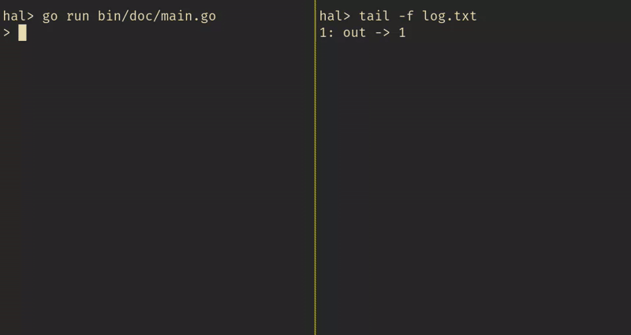

# digital

A Go package for simulating digital circuits.

```go
ct := NewCircuit()

// Create some wires.
a := NewWire()
b := NewWire()
out := NewWire()

// Add a NAND gate.
ct.AddNand(a, b, out)

// Connect inputs and outputs.
ct.ConnectInput(NewButton(a), "a")
ct.ConnectInput(NewButton(b), "b")
ct.ConnectOutput(NewBulb(out), "out")

// Simulate it.
ct.Run(500, "log.txt")
```

Running this program simulates the circuit it describes (in this case, a NAND gate, two buttons, and a bulb).
It also starts an interactive shell which allows you to control and inspect inputs and outputs connected to the circuit.
Changes to outputs are logged to _log.txt_, which can be monitored in real time using `tail -f log.txt`.

Here's what an example session looks like:



## New Components from Old

Compound components like AND gates and Flip-Flops are abstracted using functions.
For example:

```go
func addNot(ct *Circuit, a, out *Wire) {
    ct.AddNand(a, a, out)
}

func addAnd(ct *Circuit, a, b, out *Wire) {
    m := NewWire()
    ct.AddNand(a, b, m)
    addNot(ct, m, out)
}
```

It's also possible to create custom inputs and outputs.
For example, here's an input device that manipulates a "bus" of `n` wires:

```go
func nBitInput(bus *bus) *Input {
    parse := func(value string) ([]bool, error) {
            parts := strings.Split(value, "")
            if len(parts) != bus.size() {
                    return nil, errors.New("incorrect input size")
            }
            bits := make([]bool, len(parts))
            for i, p := range parts {
                    bits[i] = p != "0"
            }
            return bits, nil
    }

    return NewInput(bus.wires, parse)
}

type bus struct {
    wires []*Wire
}

func (b *bus) size() int {
    return len(b.wires)
}

func (b *bus) getWire(n int) *Wire {
    if n >= b.size() {
            panic("wire index out of bounds")
    }
    return b.wires[n]
}

func newBus(n int) *bus {
    wires := make([]*Wire, n)
    for i := 0; i < n; i++ {
            wires[i] = NewWire()
    }
    return &bus{wires}
}
```

Instances of this input can be connected to a circuit:

```go
// An 8-bit bus.
myBus := newBus(8)
// Allow the bus to be controlled by an input named "xs".
ct.ConnectInput(nBitInput(myBus), "xs")
```

And the value of the bus can be set during an interactive session by running
commands like:

```shell
> set xs 01101110
```
